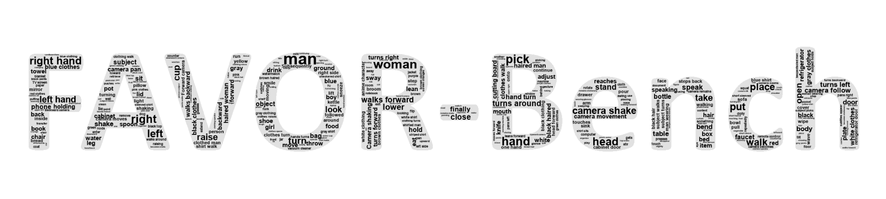
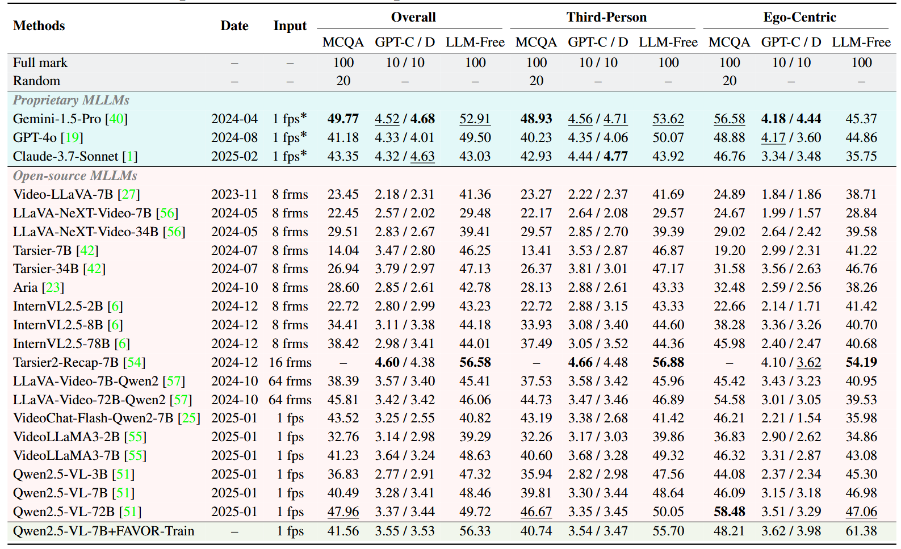
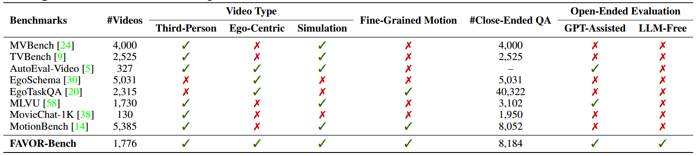
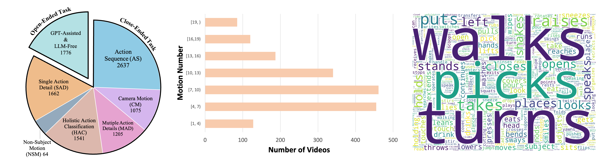
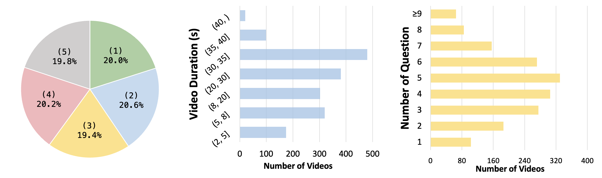

# FAVOR-Bench

<div align="center">

<p align="center">
    
</p>

<h1>A Comprehensive Benchmark for Fine-Grained Video Motion Understanding</h1>


[](https://arxiv.org/abs/2503.14935)
[](https://huggingface.co/datasets/zl2048/FAVOR) 
[](https://favor-bench.github.io/)


</div>

---

## 🔥 News

* **`2025.03.19`** 🌟 We released Favor-Bench, a new benchmark for fine-grained video motion understanding that spans both ego-centric and third-person perspectives with comprehensive evaluation including both close-ended QA tasks and open-ended descriptive tasks!

## Introduction

Multimodal Large Language Models (MLLMs) have shown remarkable capabilities in video content understanding but still struggle with fine-grained motion comprehension. To comprehensively assess the motion understanding ability of existing MLLMs, we introduce FAVOR-Bench, comprising 1,776 videos with structured manual annotations of various motions. Our benchmark includes both close-ended and open-ended tasks. For close-ended evaluation, we carefully design 8,184 multiple-choice question-answer pairs spanning six distinct sub-tasks. For open-ended evaluation, we develop both a novel cost-efficient LLM-free and a GPT-assisted caption assessment method, where the former can enhance benchmarking interpretability and reproducibility. Comprehensive experiments with 21 state-of-the-art MLLMs reveal significant limitations in their ability to comprehend and describe detailed temporal dynamics in video motions. To alleviate this limitation, we further build FAVOR-Train, a dataset consisting of 17,152 videos with fine-grained motion annotations. The results of finetuning Qwen2.5-VL on FAVOR-Train yield consistent improvements on motion-related tasks of TVBench, MotionBench and our FAVOR-Bench. Comprehensive assessment results demonstrate that the proposed FAVOR-Bench and FAVOR-Train provide valuable tools to the community for developing more powerful video understanding models.

## Evaluation Tasks

<p align="center">
    
</p>

## Evaluate

### Close-ended tasks
We give the example of evaluating Qwen2.5-VL on the close-ended tasks of FAVOR-Bench as follows:

1. Download the [FAVOR-Bench videos](https://huggingface.co/datasets/zl2048/FAVOR) and put all the mp4 files in one directory (for example, `./test_videos`)
2. Install the required dependencies and download checkpoints following the [official repo](https://github.com/QwenLM/Qwen2.5-VL).
3. Run the inference code:
```
python inference_qa_qwen.py
```
Then the results will be written to a jsonl file in `./output_qa/` and the scores will be printed.

### LLM-free evaluation
We give the example of LLM-free evaluation as follows:

1. Prepare the necessary environments. nltk and sentence-transformers are needed
```
pip install sentence-transformers nltk
```
2. Enter the folder
```
cd LLM-free
```
3. Run the `LLM-free_step1_extract.ipynb` notebook, then extract results will be generated.
4. Run the compare code, then the scores will be generated.
```
python LLM-free_step2_compare.py
```


## 📈 Results

- **Model Comparision:**

<p align="center">
    
</p>

- **Benchmark Comparison:**

<p align="center">
    
</p>


- **Benchmark Statistics:**

<p align="center">
    
</p>
Data statistics of FAVOR-Bench. Left: Task type distribution across close-ended and open-ended evaluation in FAVOR-Bench. Middle: Distribution of motion numbers (motion sequence length) per video. Right: The word cloud statistics of motion vocabularies in FAVOR-Bench.
<p align="center">
    
</p>
More data statistics of FAVOR-Bench. Left: Index distribution of correct answers for the close-ended tasks. For example, "(1)" indicates that the correct option is ranked first. Middle: Video duration distribution of FAVOR-Bench. Right: Question number distribution for videos of FAVOR-Bench.

## Citation

If you find our work helpful for your research, please consider citing our work.

```bibtex
@misc{tu2025favor,
      title={FAVOR-Bench: A Comprehensive Benchmark for Fine-Grained Video Motion Understanding},
      author={Chongjun Tu and Lin Zhang and Pengtao Chen and Peng Ye and Xianfang Zeng and Wei Cheng and Gang Yu and Tao Chen},
      year={2025},
      eprint={2503.14935},
      archivePrefix={arXiv},
      primaryClass={cs.CV}
}
```
